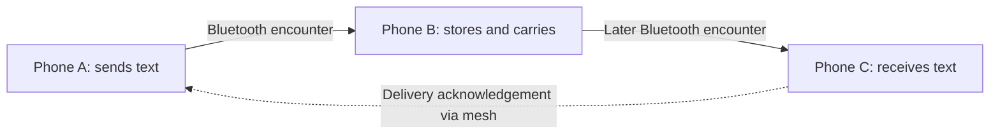

# Nored

**Stay connected when the signal disappears.**

Built for **Hack the North 2026**, Nored is an offline communication app for iOS and Android. Nearby phones connect over Bluetooth to exchange messages, carry text to people they encounter later, and spread emergency alerts—all without cellular service, an internet connection, or a messaging server.

## Why we built it

At a crowded event, on a remote trail, or during a network outage, people can be close enough to help each other and still have no way to communicate. Nored turns the phones around you into a local communication network. Each participating phone can carry messages, extending communication beyond a single Bluetooth connection.

Connection also means being understood and having something to do together. Nored combines messaging with on-device voice transcription, translation, and nearby multiplayer games.

## What it does

| Feature | How it works |
| --- | --- |
| **Nearby discovery** | Find participating phones over Bluetooth, choose a display name, and start a conversation without an account or phone number. |
| **Direct and group text** | Chat with nearby peers; group membership and text propagate through the mesh. |
| **Store-and-forward delivery** | Save someone as a contact while nearby, then queue text for delivery through other phones when that person is out of range. Messages and relay packets persist locally. |
| **Emergency alerts** | Broadcast an `INFO`, `HELP`, or `DANGER` alert. Alerts receive transmission priority, with hop limits, expiry, and duplicate suppression. |
| **Photos and voice notes** | Exchange images and recorded audio over a direct Bluetooth connection, with chunked transfers and retry handling. |
| **On-device AI** | Transcribe voice notes with Whisper and translate into the viewer's supported language: English, French, or Hindi. Offline use requires the bundled model and prepared language packs. |
| **Network view** | Explore discovered peers, signal information, and locally observed message journeys. |
| **Nearby games** | Invite peers to chess, Pong, or Drawing Telephone over Bluetooth. |

These describe the current implementation. Physical-device validation status and prototype boundaries are documented below.

## How the mesh works

Each phone acts as both a Bluetooth LE central and peripheral. A custom native Expo module implements discovery and GATT communication in Swift on iOS and Kotlin on Android. A shared TypeScript router handles message persistence, forwarding, retries, and delivery acknowledgements.



A and C do not need a continuous connection. After A has saved C as a contact, B can accept a message from A, retain it after disconnecting, and forward it when C becomes reachable. A relay receipt means a phone has stored the packet; **Delivered** means the destination's acknowledgement has made its way back to the sender.

Peers exchange packet inventories to avoid unnecessary retransmission. Packet IDs suppress duplicates, while hop limits and expiry keep messages from circulating indefinitely. Direct and group text use a five-hop, 24-hour budget; alerts use up to ten hops and expire after six hours. Photos and voice notes currently require a direct connection.

Read the [store-and-forward implementation notes](nored/docs/store-and-forward.md) for protocol and persistence details.

## Beyond phones: the HTN badge

The repo also includes an experimental **ESP32-C3 badge relay**. Custom firmware lets a Hack the North badge bridge two Nored phone connections over BLE and display recent alerts. It also includes a local Wi-Fi portal for submitting alerts.

There is a separate Lua app for badge-to-badge canned messages on stock firmware. That radio channel does not connect to the phone mesh. The custom firmware replaces the stock badge environment; see the [badge setup and firmware guide](nored-badge/README.md) before flashing.

## Built with

| Layer | Technologies |
| --- | --- |
| Mobile app | React Native, Expo SDK 57, Expo Router, TypeScript |
| Bluetooth transport | Custom Expo module, Swift / CoreBluetooth, Kotlin / Android BLE GATT |
| Mesh and storage | TypeScript router, Expo SQLite, local media files |
| Speech and translation | `whisper.rn` / whisper.cpp, quantized Whisper base model, `expo-translate-text`, Apple Translation / Google ML Kit |
| Games | Shared Bluetooth transport, `chess.js`, custom Pong and drawing logic |
| Badge firmware | C, ESP-IDF, NimBLE, ESP32-C3; Lua for the separate stock-firmware app |

## Run it locally

Use a physical iPhone or Android phone for Bluetooth testing, and at least two phones to try messaging. Install Node.js/npm and the native build tools for your target platform: Xcode on macOS for iOS, or Android Studio and the Android SDK for Android. **Expo Go cannot load the custom native modules.**

From the repository root:

```bash
cd nored
npm install
npm run models:fetch
```

The last command downloads the approximately 57 MB Whisper model into `assets/models/`. It is gitignored and bundled into the app during the native build.

For iOS signing, copy `app.local.example.json` to `app.local.json` and set your own bundle identifier and Apple team ID. Build for your connected device:

```bash
# iOS
npx expo run:ios --device

# Android
npx expo run:android --device
```

For subsequent development sessions:

```bash
npx expo start --dev-client
```

Before testing offline translation, prepare the required language packs while online and try the language pairs you intend to demonstrate. iOS translation requires iOS 18 or later. Use a physical device for transcription. See the [app setup guide](nored/README.md) for additional model and translation details.

### Build for an offline demo

A development session normally depends on Metro. Build a release app with bundled JavaScript before disconnecting from the network:

```bash
# Run the command for your platform from nored/
npm run ios:offline -- --device
npm run android:offline -- --device
```

Open Nored once, grant the requested permissions, and finish model/language preparation before enabling airplane mode. Then turn Bluetooth back on, keep Wi-Fi off, and keep every participating app in the foreground.


This is a demo procedure, not a record of completed hardware tests.

## Prototype status and next steps

Nored is a hackathon prototype. The repository includes automated tests for routing, persistence, media transfer, game state, and transcription/translation logic.

Current boundaries:

- **Foreground operation:** Participating apps must remain open for discovery and forwarding.
- **Best-effort delivery:** Messages need suitable Bluetooth encounters before their hop or expiry limits are reached.
- **Direct-only media:** Photos and voice notes do not use durable multi-hop forwarding.
- **Security:** The current mesh has no application-level encryption or cryptographic authentication. Device IDs and saved contacts are addressing mechanisms, not verified identities.
- **One-time online preparation:** Dependencies, the Whisper model, and translation packs must be downloaded before offline use.

Next steps are authenticated end-to-end encryption, more resilient background operation, and faster media transport.

## Repository guide

| Path | Contents |
| --- | --- |
| [`nored/`](nored/) | Mobile app, native Bluetooth module, and tests |
| [`nored/src/mesh/`](nored/src/mesh/) | Routing, persistence, alerts, chat state, and topology |
| [`nored/src/transcription/`](nored/src/transcription/) | Local speech recognition and translation |
| [`nored/src/games/`](nored/src/games/) | Multiplayer game state and UI |
| [`nored-badge/`](nored-badge/) | Stock badge Lua app and custom ESP32 firmware |
| [`SPECS.md`](SPECS.md) | Original product goals and planned acceptance criteria; some items extend beyond the current prototype |

To run the app's automated checks:

```bash
cd nored
npm test
npm run lint
npx tsc --noEmit
```
